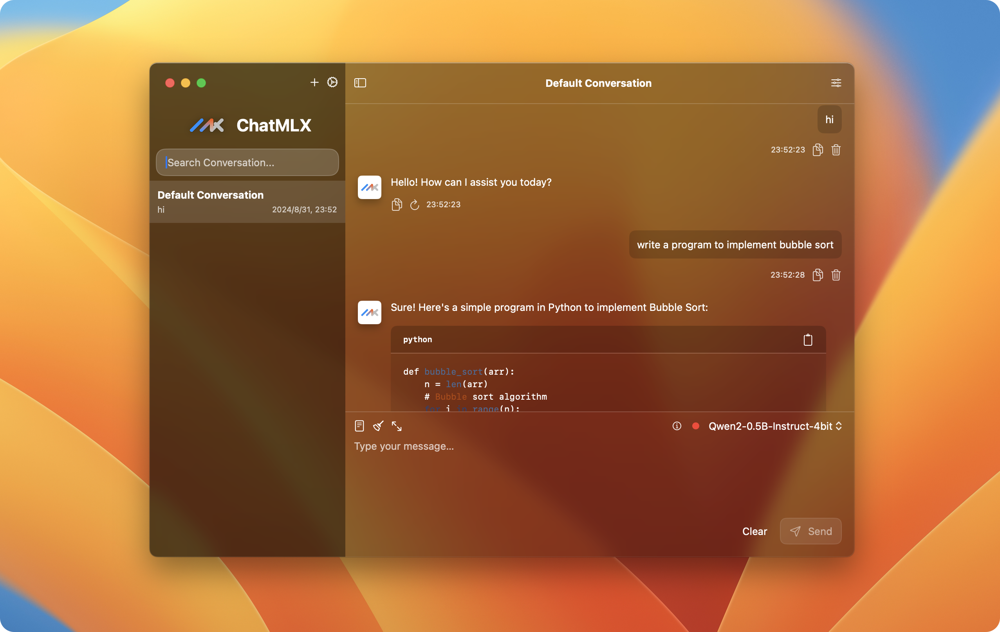
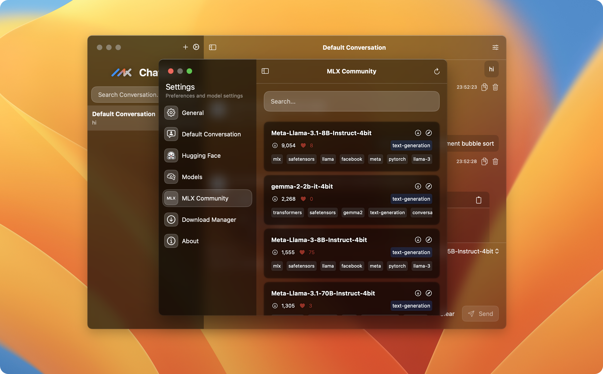

[English](./README.md) | 简体中文

[![贡献者][contributors-shield]][contributors-url]
[![分支数][forks-shield]][forks-url]
[![星标数][stars-shield]][stars-url]
[![问题数][issues-shield]][issues-url]
[![Apache 许可证][license-shield]][license-url]

 

  

<h3 align="center">ChatMLX</h3>

  

    ChatMLX 是一款现代化的开源高性能聊天应用，基于大型语言模型，依托于强大的<a href="https://github.com/ml-explore/mlx-swift">MLX</a>和 Apple silicon。它支持多种模型，为用户提供丰富多样的对话选项。该应用在本地运行 LLM，以确保用户隐私和安全。
     
     
    <a href="https://github.com/maiqingqiang/ChatMLX/issues">报告错误</a>
    ·
    <a href="https://github.com/maiqingqiang/ChatMLX/issues">请求功能</a>
    ·
    <a href="https://github.com/maiqingqiang/ChatMLX/releases">下载</a>
  

## 特性 🚀

- **多语言**：支持英语、简体中文、繁体中文、日语和韩语。
- **多个模型**：提供多个模型，包括 Llama、OpenELM、Phi、Qwen、Starcoder 和 Cohere。
- **高性能**：基于 MLX 和 Apple silicon 的强大性能。
- **隐私与安全**：在本地运行 LLM，以确保用户隐私和安全。
- **开源**：开源项目，欢迎贡献。

> [!NOTE]
>
> 与 macOS 14.0及更高版本兼容。

## 参与贡献 🤝

我们非常欢迎各种形式的贡献。如果你对贡献 ChatMLX 感兴趣，可以大展身手，向我们展示你的奇思妙想。

[![][github-contrib-shield]][github-contrib-link]

## Links 🌐

- [MLX Swift](https://github.com/ml-explore/mlx-swift) - [MLX](https://github.com/ml-explore/mlx)的Swift API
- [Transformers Swift](https://github.com/huggingface/swift-transformers) -
  在Swift中实现类似于[transformers](https://github.com/huggingface/transformers)的API的Swift包
- [Jinja Swift](https://github.com/maiqingqiang/Jinja) - 一个简约的 Swift
  实现 [Jinja](https://jinja.palletsprojects.com/en/3.1.x/) 模板引擎，专门用于解析和渲染 ML 聊天模板。

## Star 历史 🌟

[![][back-to-top]](#readme-top)

[contributors-shield]: https://img.shields.io/github/contributors/maiqingqiang/ChatMLX.svg?style=for-the-badge

[contributors-url]: https://github.com/maiqingqiang/ChatMLX/graphs/contributors

[forks-shield]: https://img.shields.io/github/forks/maiqingqiang/ChatMLX.svg?style=for-the-badge

[forks-url]: https://github.com/maiqingqiang/ChatMLX/network/members

[stars-shield]: https://img.shields.io/github/stars/maiqingqiang/ChatMLX.svg?style=for-the-badge

[stars-url]: https://github.com/maiqingqiang/ChatMLX/stargazers

[issues-shield]: https://img.shields.io/github/issues/maiqingqiang/ChatMLX.svg?style=for-the-badge

[issues-url]: https://github.com/maiqingqiang/ChatMLX/issues

[license-shield]: https://img.shields.io/github/license/maiqingqiang/ChatMLX.svg?style=for-the-badge

[license-url]: https://github.com/maiqingqiang/ChatMLX/blob/main/LICENSE

[github-contrib-link]: https://github.com/maiqingqiang/ChatMLX/graphs/contributors

[github-contrib-shield]: https://contrib.rocks/image?repo=maiqingqiang/ChatMLX

[back-to-top]: https://img.shields.io/badge/-BACK_TO_TOP-151515?style=flat-square
