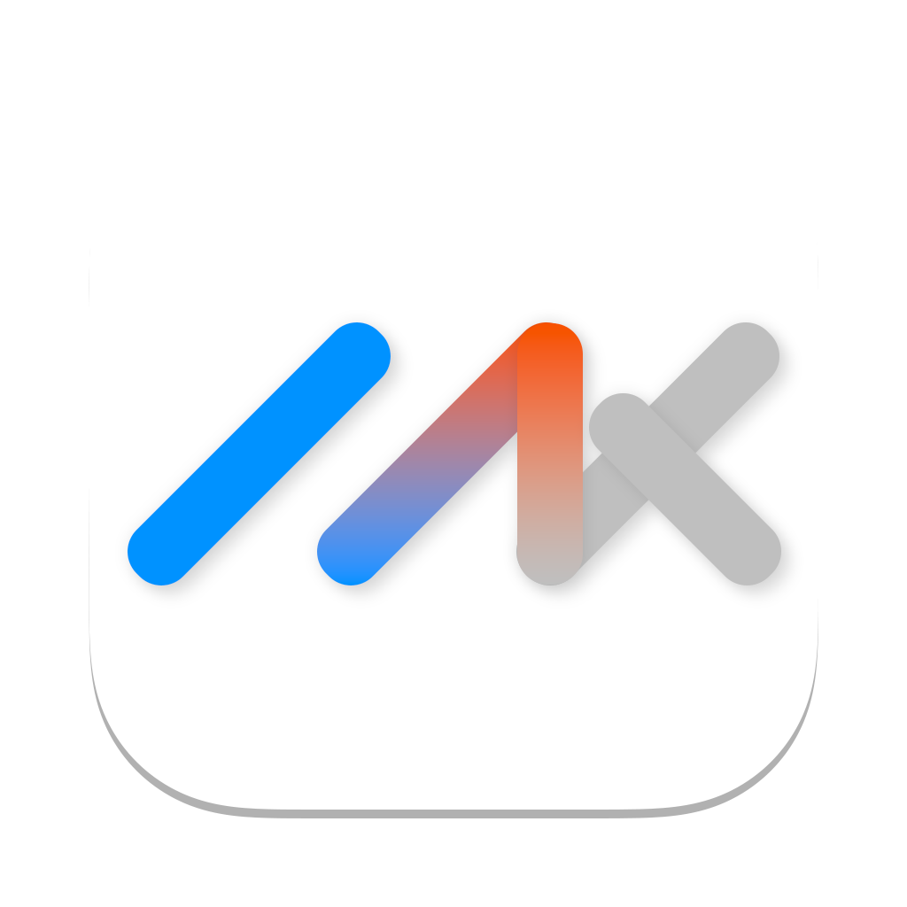

[![Contributors][contributors-shield]][contributors-url]
[![Forks][forks-shield]][forks-url]
[![Stargazers][stars-shield]][stars-url]
[![Issues][issues-shield]][issues-url]
[![MIT License][license-shield]][license-url]

 

  

  <h3 align="center">ChatMLX</h3>

  

    ChatMLX is a large model real-time conversation app implemented using <a href="https://github.com/ml-explore/mlx-swift">MLX</a>
     
     
    <a href="https://github.com/maiqingqiang/ChatMLX/issues">Report Bug</a>
    ·
    <a href="https://github.com/maiqingqiang/ChatMLX/issues">Request Feature</a>
  

> ⚠️ Still under development and improvement.

[![Product Name Screen Shot][product-screenshot]](https://github.com/maiqingqiang/ChatMLX)

## Usage

1. Clone [mlx-community](https://huggingface.co/mlx-community) specified model repository
2. Run ChatMLX
3. Select the cloned model.

## TODO

- [ ] Improve conversation
- [ ] Support more models
- [ ] Download models
- [ ] Custom parameters
- [ ] Agent Plugin
- more...

(<a href="#readme-top">back to top</a>)

[contributors-shield]: https://img.shields.io/github/contributors/maiqingqiang/ChatMLX.svg?style=for-the-badge
[contributors-url]: https://github.com/maiqingqiang/ChatMLX/graphs/contributors
[forks-shield]: https://img.shields.io/github/forks/maiqingqiang/ChatMLX.svg?style=for-the-badge
[forks-url]: https://github.com/maiqingqiang/ChatMLX/network/members
[stars-shield]: https://img.shields.io/github/stars/maiqingqiang/ChatMLX.svg?style=for-the-badge
[stars-url]: https://github.com/maiqingqiang/ChatMLX/stargazers
[issues-shield]: https://img.shields.io/github/issues/maiqingqiang/ChatMLX.svg?style=for-the-badge
[issues-url]: https://github.com/maiqingqiang/ChatMLX/issues
[license-shield]: https://img.shields.io/github/license/maiqingqiang/ChatMLX.svg?style=for-the-badge
[license-url]: https://github.com/maiqingqiang/ChatMLX/blob/main/LICENSE
[product-screenshot]: images/screenshot.png